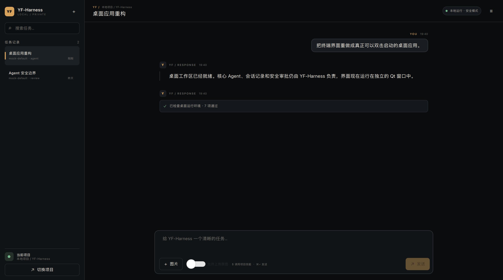

# YF-Harness

YF-Harness 是一个本地优先、桌面优先、模型无关的个人 LLM Agent Harness。它提供可双击启动的
原生桌面工作区，同时保留 CLI/TUI 作为自动化和兼容入口。它统一 Provider 流式事件，运行有边界的
Agent 状态机，安全调用文件、搜索、Patch、Shell 和 Git 工具，并保存会话、Trace、Token、成本、
审批与评测记录。

项目名：YF-Harness · Python 包：`yfharness` · CLI：`yfh` · Python：3.12+ · License：MIT。

## Harness 是什么

模型只生成不可信建议；Harness 负责组装上下文、请求模型、解析事件、验证工具 Schema、执行策略、
请求审批、限制 workspace、持久化运行和恢复异常。核心实现不依赖高级框架或供应商 SDK；LangChain、
LlamaIndex 和 AutoGen 通过可选、惰性加载的适配层接入，既保留可学习的核心，也能直接运行生态框架。

## 功能

- MockProvider：无网络、无 API Key，支持流式文本、脚本化工具调用和故障模拟。
- OpenAICompatibleProvider：可配置 `base_url`、模型、超时、有限重试和 SSE/JSON 响应。
- Chat / Plan / Agent / Review 四模式共享同一状态机。
- Balanced / Plan / Guarded 版本化 Workflow，可组合模式、审批、工具可见性与声明式 Hook。
- 15 个真实工具；Pydantic 参数校验、审批策略、Diff 预览、原子写入和 `/undo`。
- 路径穿越与符号链接逃逸防护；Shell 超时、进程组终止、输出限制和环境脱敏。
- SQLite 会话、运行、消息、模型事件、工具、审批、用量、上下文和文件变更记录。
- PySide6 + Qt Quick 原生桌面 App：会话导航、流式对话、模型/模式设置、取消和工具审批。
- 图片附件默认仅本地；只有显式打开发送开关后才进入远程模型请求。
- 运行中后续任务队列、Plan→Execute 显式确认、会话分支和可恢复的长期工作流。
- 统一发现 `AGENTS.md`、`CLAUDE.md`、Cursor Rules 与 `.yfh` 指令，并显示实际上下文来源。
- Git 感知的本地项目索引，按路径、内容和工作区状态自动选择相关文件，全程不上传代码。
- 逐文件 Diff 审查与持久化检查点；撤销前校验修改后哈希，拒绝覆盖后续人工编辑。
- Codex / Claude Code / Cursor 项目技能统一发现；桌面输入 `$` 即可搜索和显式调用。
- 整次 Agent 运行可原子式回退；任一文件存在后续编辑时，整组撤销不会部分生效。
- Textual 三栏 TUI：流式 Markdown、会话、工具折叠、审批、设置、诊断和响应式布局。
- 项目指令、手动/自动文件上下文、Token 预算与八字段结构化压缩。
- 轮转文本/JSONL 日志、Trace、只读 Replay 和 20 类离线 Eval。
- LangChain、LlamaIndex、AutoGen 真实 Agent API 集成；支持离线 Mock 和现有 OpenAI-compatible 配置。
- MCP stdio 工具使用名称隔离、环境白名单和现有审批链；项目插件只静态发现。

## 截图



这是由打包后的真实 macOS App 渲染的界面。更新方法见
[`docs/images/README.md`](docs/images/README.md)。

## 架构概览

```text
Qt Quick Desktop / CLI / Textual TUI
        │
        ▼
AgentRunner ── ContextBuilder / ProjectIndex
   │   │
   │   ├── Provider → ModelEvent stream
   │   └── ToolExecutor → Policy → Approval → WorkspaceGuard → Tool
   ▼
Repositories → SQLite        Observability → JSONL / Trace / Eval / Replay
```

完整图和依赖方向见 [`docs/ARCHITECTURE.md`](docs/ARCHITECTURE.md)。
规则融合、自动上下文和恢复语义见 [`docs/PROJECT_INTELLIGENCE.md`](docs/PROJECT_INTELLIGENCE.md)。

## 安装

### uv

```bash
git clone https://github.com/YfengJ/yf-harness.git YF-Harness
cd YF-Harness
uv sync --extra dev
uv run yfh --help
```

启动桌面版：

```bash
uv sync --extra desktop
uv run yfh desktop
```

需要全部高级框架时：

```bash
uv sync --extra dev --extra frameworks
# 或 pip install -e '.[dev,frameworks]'
```

### 普通 pip 与 venv

```bash
python3.12 -m venv .venv
source .venv/bin/activate        # Windows: .venv\Scripts\activate
python -m pip install -U pip
python -m pip install -e '.[dev]'
yfh --help
```

## 无 API Key 快速体验

```bash
uv run yfh desktop
```

Mock 是默认 Provider；首次运行会在 platformdirs 对应的用户数据目录创建 SQLite，而不是把历史写入仓库。
使用 `--no-save` 可运行一次性任务。

## macOS App：双击即用

仓库已经提供一键构建脚本。它会生成自包含 App Bundle、创建图标、进行本机临时签名，并实际启动验证：

```bash
./scripts/build_macos_app.sh
open dist/YF-Harness.app
```

也可以在 Finder 中直接双击 `dist/YF-Harness.app`，或把它拖入“应用程序”。本地构建采用 ad-hoc
签名，适合本机使用；发给其他人之前仍需 Apple Developer ID 签名和 notarization。完整说明见
[`docs/DESKTOP_APP.md`](docs/DESKTOP_APP.md)。

如果本机已经有此仓库构建好的 App，最短启动方式就是在 Finder 打开项目的 `dist` 目录，双击
`YF-Harness.app`。不需要先启动终端，也不需要 API Key；默认 MockProvider 可以直接体验完整界面。
首次打开后点击左下角“切换项目”；App 会在本机配置目录记住这个选择，下次双击自动恢复。

## 项目技能与 `$` 命令面板

桌面输入框键入 `$` 会打开技能面板，支持键盘上下选择、Enter/Tab 插入，也可鼠标点击。当前兼容：

- `.yfh/skills/*/SKILL.md`
- `.agents/skills/*/SKILL.md`
- `.claude/skills/*/SKILL.md` 与 `.claude/commands/*.md`
- `.cursor/commands/*.md`

同名技能必须使用完整的 `source:name`。完整正文只在用户显式选择后进入当次上下文；脚本与资源不会
自动执行，`allowed-tools` 也不会授予权限。CLI 可用 `yfh skills list`、`yfh skills show <name>` 和
`yfh run --skill <name> "任务"`。详细边界见 [`docs/PROJECT_SKILLS.md`](docs/PROJECT_SKILLS.md)。

## 配置 DeepSeek 或其他兼容服务

复制 [`examples/config.example.toml`](examples/config.example.toml) 到 `yfh config path` 输出的位置，
并填写服务当前实际支持的模型名称：

```toml
default_provider = "deepseek"
default_model = "deepseek_chat"

[providers.deepseek]
type = "openai_compatible"
base_url = "${DEEPSEEK_BASE_URL}"
api_key_env = "DEEPSEEK_API_KEY"
timeout_seconds = 120

[models.deepseek_chat]
id = "deepseek_chat"
provider = "deepseek"
model = "由用户填写的模型名称"
supports_streaming = true
supports_native_tools = true
context_window = 64000
```

```bash
export DEEPSEEK_BASE_URL='https://your-service.example/v1'
export DEEPSEEK_API_KEY='...'
yfh doctor
yfh run --provider deepseek --model deepseek_chat "你好"
```

本地兼容服务可把 `base_url` 设置为如 `http://127.0.0.1:11434/v1` 并留空 `api_key_env`。
上下文长度、能力和价格只来自用户配置；YF-Harness 不把示例模型名或价格当作永久事实。

配置优先级：CLI > `YFH_*` 环境变量 > `.yfh/config.toml` > 用户配置 > 默认值。
API Key 只通过 `api_key_env` 指定的环境变量读取，不写入配置展开结果、数据库、日志或导出。

## 兼容 TUI

```bash
yfh tui
```

快捷键：`Ctrl+N` 新会话、`Ctrl+K` 命令提示、`Ctrl+C` 取消运行、`Ctrl+L` 输入、
`Ctrl+P` 模式、`Ctrl+O` 会话、`Ctrl+Enter` 发送、`Alt+↑/↓` 输入历史、`F1` 帮助。

常用 Slash Commands：`/new`、`/sessions`、`/mode`、`/permissions`、`/add`、`/context`、
`/compact`、`/undo`、`/doctor`、`/export`、`/stop`、`/quit`。命令由客户端解析，不发送给模型。

## 无界面 CLI

```bash
yfh chat
yfh run "任务内容"
yfh run --file task.md
yfh sessions list
yfh sessions export <session_id> --format json
yfh providers list
yfh models list
yfh tools list
yfh workflows list
yfh mcp list
yfh plugins list
yfh skills list
yfh run --skill codex:review-changes "检查当前改动"
yfh doctor --no-network
yfh eval
yfh replay <run_id>              # 默认只读，不执行工具
yfh config show
yfh config path
```

图片在 CLI 中同样默认不上传：`yfh run --image screen.png "检查这张图"`。
只有加上 `--send-images` 才会把验证后的图片内容发送给声明
`supports_image_input = true` 的兼容模型。Workflow、MCP 和插件契约见
[`docs/WORKFLOWS_MCP.md`](docs/WORKFLOWS_MCP.md)。

## 高级 Agent 框架

框架是可选边界，不会替换 `AgentRunner`。安装后可发现、诊断并用相同 Provider/Model 配置运行：

```bash
yfh frameworks list
yfh frameworks doctor
yfh frameworks run langchain "总结这段需求"
yfh frameworks run llamaindex "分析这个问题" --output json
yfh frameworks run autogen "给出实施方案" --provider deepseek --model deepseek_chat
```

也可只安装一个：`pip install 'yf-harness[langchain]'`、`[llamaindex]` 或 `[autogen]`。
MockProvider 会实例化每个框架自己的 Agent/模型接口，完全离线运行；远程 Provider 会实例化该框架的
官方 OpenAI-compatible 客户端。当前适配层故意传入空工具集，避免第三方执行循环绕过 YF-Harness 的
审批和 workspace 防线；需要文件、Shell、Git 等能力时继续使用 `yfh run`。完整契约与 Python API
示例见 [`docs/FRAMEWORK_INTEGRATIONS.md`](docs/FRAMEWORK_INTEGRATIONS.md)。

`yfh run` 支持 stdin、文本/JSON 输出、超时和非零错误码，适合 CI。Replay 只有在显式
`--execute` 并确认后才重新执行。

## 安全说明

- 模型、用户输入和工具参数均不可信；工具名和参数必须通过注册表与 Schema。
- 所有文件路径经真实路径解析，限制在 workspace；搜索不跟随符号链接。
- Plan、Review、Chat 不允许写入。`full_auto` 默认禁用；删除与 Shell 始终审批。
- Shell 默认参数数组、有限环境、超时与输出上限；Shell 字符串必须显式 `shell=true`。
- 网络命令提升为 critical 风险并审批。当前不是 OS/容器级网络沙箱，见已知限制。
- 日志和导出递归脱敏；不要把密钥写进任务文本或文件。

完整威胁模型见 [`docs/SECURITY_MODEL.md`](docs/SECURITY_MODEL.md)。

## 配置与数据位置

```bash
yfh config path
yfh doctor --no-network
```

跨平台路径由 platformdirs 决定。测试或便携环境可设置 `YFH_CONFIG_DIR`、`YFH_DATA_DIR`、
`YFH_LOG_DIR`。数据库文件是数据目录中的 `yfharness.sqlite3`；日志目录包含 `yfharness.log`
和 `debug.jsonl`。

## 质量与测试

```bash
uv run ruff check .
uv run ruff format --check .
uv run mypy src
uv run pytest
uv run pytest -m desktop
uv run pytest -m frameworks
uv run pytest --cov=yfharness --cov-report=term-missing
uv run yfh eval
uv build
```

普通测试和 Eval 不依赖真实 API。真实 Provider 测试应只在显式环境变量存在时单独运行，并不得录制密钥。

## 学习路线

从 [`docs/LEARNING_PATH.md`](docs/LEARNING_PATH.md) 开始，推荐顺序：领域模型与事件 → Provider →
Agent Loop → Tool/Security → Storage → Context → TUI → Observability/Eval。每份核心文档结尾都有理解目标、
可改实验、常见 Bug、面试问题和动手练习。

## 已知限制

- 第一版是单进程本地应用；多个实例同时运行时，崩溃恢复可能把遗留 running 记录标为 interrupted。
- Shell 网络控制是风险识别与审批，不是操作系统级网络隔离；高对抗场景应放入容器/沙箱。
- Windows 子进程树终止是尽力而为；CI 会验证基础行为，复杂进程树仍需平台专项测试。
- 无专用 tokenizer 时使用明确标记的近似估算；兼容服务的非标准 SSE 可能需要适配。
- 自包含 macOS App 会携带 Qt 运行时，因此体积明显大于 Python wheel；公开分发还需要正式签名与公证。
- TUI 是兼容入口，在很小终端会隐藏侧栏并显示警告；完整交互建议宽度 95 列以上。
- 当前不提供训练、云端账户、浏览器自动化、向量数据库或分布式多 Agent；框架适配器目前也不注入本地工具。

## Roadmap 与贡献

见 [`docs/ROADMAP.md`](docs/ROADMAP.md) 和 [`CONTRIBUTING.md`](CONTRIBUTING.md)。新增 Provider 必须输出统一
`ModelEvent`；新增工具必须声明 Schema、风险和只读属性，并补充拒绝、越界与错误路径测试。

## License

[MIT](LICENSE)
