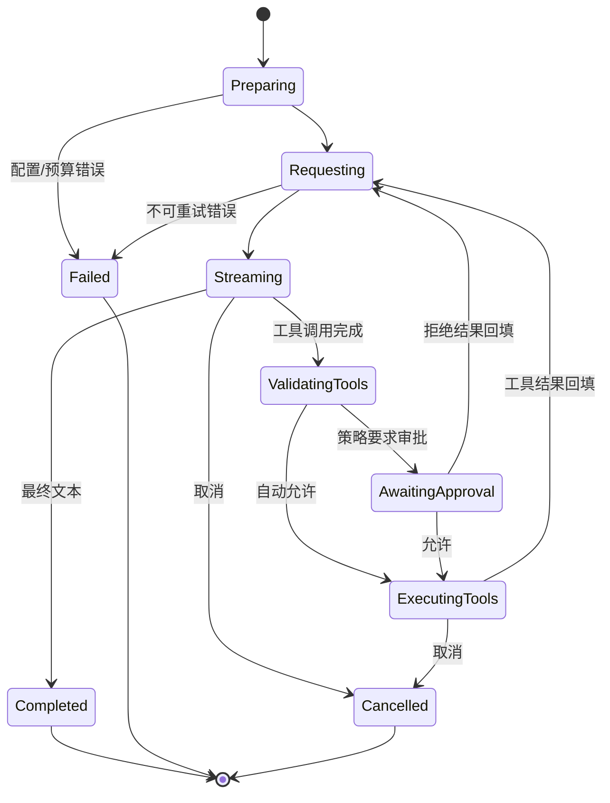
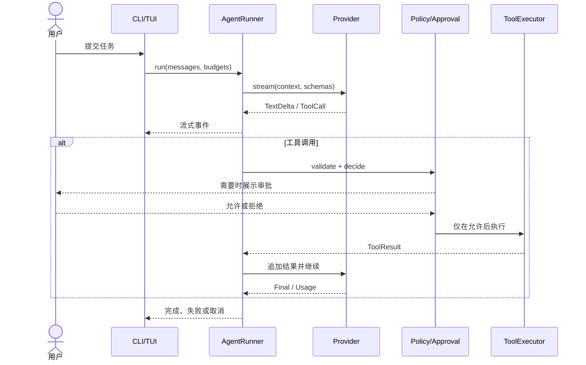

# Agent Loop

`AgentRunner` 是可观察、可取消、有预算的显式状态机。它不递归调用自身，也不让 Provider 直接执行工具。只有在第一个模型事件之前的暂态故障可重试，避免流式输出后重复副作用。

一个没有状态、预算和终态原因的无限 `while` 无法区分“继续工作”和“已经失控”，也难以正确处理取消、流式重试及崩溃恢复。显式状态让每条边都可测试并写入 Trace。

每轮检查总时间、步骤、工具次数、重复调用、Token 和配置成本预算。原生 Tool Calling 与 JSON 降级协议最终都产生相同 `ToolCall`。Schema 失败只允许有限修复；同参调用重复时停止循环。Chat/Plan/Review 用策略禁止写入，Agent 才可能进入写工具审批。

取消会传播到 Provider 流与工具执行；Shell 会尝试终止进程组。最终状态和错误写入运行记录，启动恢复会把遗留 `running` 标为 `interrupted`。

## 我应该理解什么

状态转移、重试边界、副作用只执行一次的原则和各预算的关系。

## 我可以修改什么来做实验

降低最大步骤数，构造重复工具脚本，观察终止原因和 Trace。

## 常见 Bug

流式后重试导致文本重复、工具结果未回填、取消只停 UI 不停子进程、预算边界差一。

## 面试可能如何提问

怎样保证 Agent 不无限循环？何时能安全重试流式请求？

## 一个动手练习

用 scripted MockProvider 创建两次相同工具调用，并为循环检测补一条测试。
