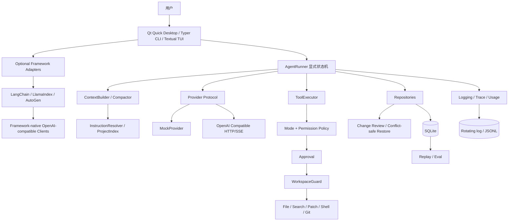

# 架构

YF-Harness 采用端口与适配器式分层：核心只认识领域对象和抽象协议，Qt 桌面、CLI/TUI、Provider、工具、存储是边缘适配器。依赖始终指向核心，供应商响应和数据库行不能成为跨层契约。

一次请求由界面创建领域消息，经上下文预算后交给 Provider。统一事件驱动输出或工具调用；工具结果作为新消息回到同一循环，直到完成、取消或触发预算。Repository 记录可恢复事实，日志记录运行诊断，两者都在写入前脱敏。

桌面 Bridge 在单工作线程中运行独立 asyncio loop，并以 Qt queued signal 把事件送回 GUI 线程。
它调用 CLI 已抽出的 `_run_once` 编排入口，因此桌面、CLI 与 TUI 共享 Provider、AgentRunner、审批、
持久化和 Trace，不存在一条绕过安全边界的“图形界面捷径”。

`InstructionResolver` 把 YF-Harness、Claude Code、Cursor 和 Codex 的项目规则归一化为带来源、作用域
和优先级的文档；`ProjectIndex` 只在本机使用文件名、文本样本与 Git 状态排序相关文件。两者都只提供
上下文，不能获得工具执行权。文件变更仍在工具边界记录 before/after 快照，桌面审查层只有在当前哈希
等于 after_hash 时才恢复 before 内容。

关键扩展点是 `Provider`、`Tool`、策略与 Repository，而不是复制 AgentRunner。新增实现应保持事件、Schema、错误和取消语义稳定。

可选框架适配层是并列入口，不是核心依赖：它把统一的 `FrameworkRequest` 映射到框架原生 Agent，
再把文本、用量、耗时和元数据归一化为 `FrameworkResult`。适配器复用 `AppConfig` 的 Provider/Model
选择和环境变量密钥规则，但不取得 YF-Harness 工具执行权。默认安装只加载发现注册表，不导入任何框架 SDK。

## 我应该理解什么

依赖方向、统一事件边界，以及为什么执行权只属于 Harness。

## 我可以修改什么来做实验

新增一个只返回固定事件的 Provider，或在不改 AgentRunner 的前提下注册一个只读工具。

## 常见 Bug

供应商字典泄漏到 UI、绕过 Repository 写 SQL、在展示层直接执行工具。

## 面试可能如何提问

如何隔离变化频繁的模型 API？端口与适配器如何提升可测试性？

## 一个动手练习

画出一次“模型请求读取文件后回答”的实际 Trace，并标出每个信任边界。
