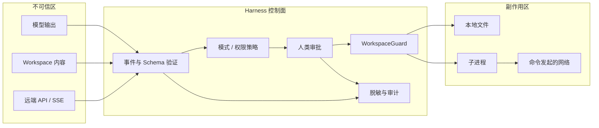

# 安全模型

YF-Harness 假设模型输出、用户提供内容、仓库文件、工具参数和远端响应均不可信。安全目标是限制本地影响面、让副作用显式可审计、避免密钥持久化；它不是恶意代码的强隔离沙箱。

路径使用真实路径解析并验证位于 workspace 内，拒绝 `..`、绝对越界和符号链接逃逸；搜索不跟随链接。写入原子完成。Shell 使用有限环境、超时、输出上限与进程组终止；可疑网络命令提升为 critical 并审批。Provider 密钥只从环境读取；桌面管理的 MCP 密钥从环境或系统钥匙串读取。日志、配置展示、Trace 与导出递归脱敏。

GitHub 集成只接受当前 workspace 的 `github.com` origin，并复用用户已有的 `gh` 登录。远端列表与
工具结果均标记为不可信；写工具始终审批，且不实现 force push、删除、合并或仓库设置。Skill 导入
拒绝符号链接与超限目录，复制到项目后仍只是指令文本，附带脚本不会自动运行。

权限从严格到宽松分为只读、逐次审批、会话内受控批准与 `full_auto`。模式是更高层上限：Chat、Plan、Review 即使选择更宽权限也不能写；Agent 写入仍按风险决策。删除和 Shell 始终审批。`full_auto` 默认关闭且风险最高，因为一次错误判断可连续放大副作用，不能把它当作绕过模式和 workspace 的开关。

残余风险：审批者可能允许恶意命令；已允许的仓库代码可能读取进程权限内数据；网络限制不是内核级；TOCTOU 与复杂 Windows 子进程树不能完全消除。高对抗代码应在容器、虚拟机或专用沙箱中运行。

## 我应该理解什么

威胁模型、各控制点覆盖的风险，以及未被覆盖的残余风险。

## 我可以修改什么来做实验

创建指向 workspace 外的符号链接，验证读、写、搜索全部拒绝。

## 常见 Bug

仅字符串前缀判断路径、脱敏只处理顶层、拒绝审批仍产生副作用、把风险提示误当隔离。

## 面试可能如何提问

如何防止 Prompt Injection 直接影响本机？路径沙箱有哪些竞态？

## 一个动手练习

增加一个嵌套认证头的日志脱敏用例，并确认文本与 JSONL 都不泄漏。
